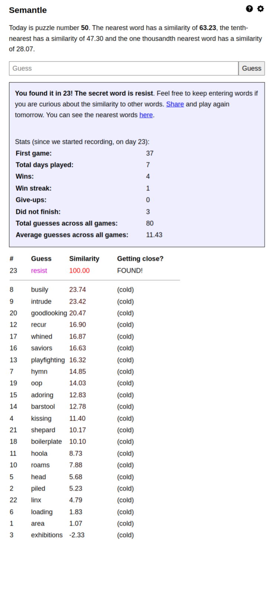
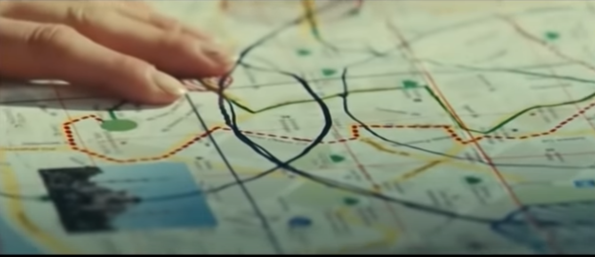
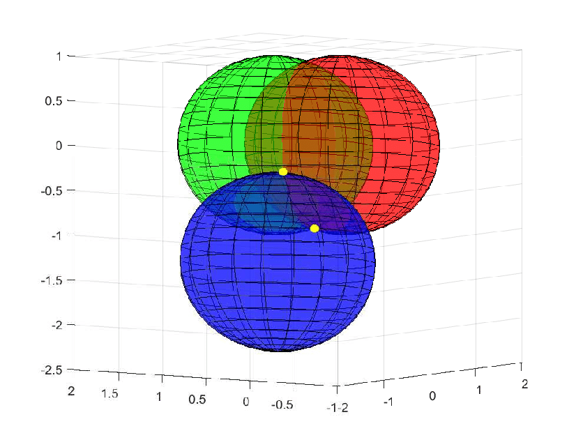

# Introduction
Hello! This is a really small repo because I just decided to put more of my scripts and little projects I spend an afternoon on up onto git. Enjoy!

This! https://semantle.novalis.org/ is an amazing game, it's called Semantle. It's the same as Wordle (https://www.nytimes.com/games/wordle/index.html), except you get Word2Vec cosine similarity scores back instead of the stuff wordle gives you. You also have unlimited guesses. There's more info on the website so check it out if you like, it's much more fun than just wordle since it involves the semantics (get it) of the words, and the featurespace of the english language represented by the Word2Vec embedding is so very different from how humans think, and I find that fascinating.

I was playing this game and of course found it quite hard, because it is hard for humans to think in terms of cosine similarity when it comes to semantics, so I decided I'd try and implement a solution that would either triangulate the solution based on the scores that semantle gives back or implement an iterative approach method not dissimilar from gradient descent. These seemed like the needed stuff in order to actually find the answer in an optimal fashion, and I still believe they will work excellently.

However I haven't done that here yet, both because this has me wanting to understand geodesics and differentiable/topological geometry much more, so I may do that first. Idk, I just think this stuff is awesome. Anyways on to the algorithms! Here's an example game for reference in the following section, where I used my algorithm to solve it.



*Note there are only 2 decimal places given for each result.*

# Usage / Install

If you want to try this out, just do this:
* Clone the repo
* Install the `gensim` library for python
* Run `train_semantle_model.py` to generate the model from the training data (unfortunately it's a bit of a storage cost to upload the models)
* Run `main.py` and use alongside semantle
* Enjoy besting your friends at this game

Or if you want to copy paste
```angular2html
git clone https://github.com/BlueHephaestus
cd SemantleHacks
pip install gensim
python3 train_semantle_model.py
python3 main.py
```
# Greedy Algorithm Used Here

As I said, there are a few ways I thought of approaching this, and I may get back into this and work on it if I feel like testing them out. Here's the one we used in this repo.

**Greedy** - Using the same word2vec model as semantle, give our model the word we just entered (e.g. area) and the score (1.07) and iterate through all other words in the featurespace, outputting all that have the same score with 2 decimal places of precision. 2 decimal places because semantle only gives us back 2 decimal places, unfortunately. This was the first thing I tried, because I thought it wouldn't work but was a simple brute force solution. Only thing is, it did work, and it's currently the system this algorithm uses, and usually produces the solution in less than 30 tries. 30 is a relevant number here because word2vec for this problem uses a 30-d vector to encode words. More on that next. 

This algorithm works by producing that list of answers, and prompting the user to input them and then feed the algorithm the highest scoring answer. In this case, we tried a bunch of other answers produced, then found that "piled" was the best with a score of 5.23. We then put that in, and got a new list of words. This produced "kissing", with aa score of 11.40. This later led to "barstool", then "goodlooking", and finally "resist", which was the answer for this one. So we had these jump points:

* area - 1.07
* piled - 5.23
* kissing - 11.40
* barstool - 12.78
* goodlooking - 20.47
* resist - 100.0

See what I mean by this isn't very intuitive for humans? This would actually be a great password generator! The general idea is that this model is taking a word, examining the cloud of points around it (at the same cosine similarity as the target word, so any of those might actually be the target word) for the one that brings it closer to the answer, then jumps to that one, gets the score, and repeats the process. 

I did not think this model would work, and in fact it's not very reliable. While in principle it can be argued that it jumps to points, it sometimes ends up in dead-ends, and has to backtrack in order to obtain the answer. So it can easily go much longer than 30 guesses. But it can also guess them in literally 2 guesses (the best possible outcome without cheating), so it's really piqued my curiousity. Anyways if you want to try it out this is the model implemented in the repo!

# Next Algorithms

If I go back to this problem, I want to make it provably optimal, rather than just a heuristic that sometimes works, sometimes doesn't. It irks me that I can't explain why this current system sometimes does really well, and sometimes does pitifully. It can easily get you out of a bind and outperforms humans easily, but this problem is fascinating and I want to make something that consistently performs really well. Anyways. Here's how I might do that!

## Triangulation, explained by Liam Neeson

The basic concept of triangulation is using known data of a few locations to pinpoint the unknown location of an object by using the observations from the known locations. This is a freaking awesome example of that happening, with a few allowances for mistakes of Hollywood: https://www.youtube.com/watch?v=HdWpg6rq85o

If you don't know triangulation, I recommend watching it, it's even got a cool explosion. 

Yea, I watched the second Taken movie. And it wasn't as good as the first but it did have the scenes where Liam Neesons got himself out of confinement like this, and I thought that was really awesome. Plus, Liam Neeson.

Anyways watch that example if you want triangulation *with explosions* and i'll continue explaining. In this example Lemon Neesons was trying to locate himself on a map, using the limited data he had about his position. At the end of the clip he has enough information, and here's what he has: 

* His approximate distance from the hotel - 4.5km
* His approximate distance from the market - 3km
* **The distance between the hotel and the market, because they have a map with those two located on it**

By drawing circles of these distances from those two points, and knowing that those two points are already at the correct distance from each other because of the map, they obtain two possible points where he could be. 



**This is triangulation.** They now have used two measures (and they aren't even very accurate) of massive areas, to get their possible locations down to just two locations! That's awesome! And if they had a third point, like the relative distance from another point on the map, they would have it down to exactly one point with even better accuracy. Triangulation is used in TONS of places - navigation, GPS, motion tracking, all sorts of stuff that involves locating objects. 

For this example, we only need data from **3** points to identify the location on a **2**-D map to perfect precision. If Liam here was in an area with tons of skyscrapers, he'd need his location on a **3**-D map, and in this case having 3 data points would greatly narrow things down but it would still have two possible locations: 



(highlighted in yellow)

So he would need **4** points in order to get this down to one point. Maybe 2 possible answers is good enough to eliminate one (as they do in this example), especially in instances where you can't afford another data point (like this case, where there were only so many cars to blow up for science). 

**The key concept here is that this trend continues, to ANY dimensional observations. For locating a N-D object, you need N+1 observations regarding that object to "triangulate" it's location.**

Ideally this would work for Semantle, since even though the measurements are only two decimal points of precision, we should be able to provably obtain the one possible answer in a 30-D featurespace by making 31 observations about it from other points, or in this case, words. After this 31st observation, we could then know exactly what it is, and then guess that for #32. I postulate that this would be consistently the upper bound, with allowances put in for the error in place by two decimal points of precision. Might implement this later.


## Gradient Descent, e.g. if Liam Neeson was much more frivolous with grenades

I think this is one of the most optimal solutions for this problem, since it avoids using tons of guesses and may converge quicker. I'm not going to explain gradient descent here, but the general idea is that you make an observation about the end goal at a point, you decide how confident you feel about that observation, and then you move towards that observation an amount proportional to your confidence. So if in the above example he had instead instructed her to keep throwing grenades in the directions that made the explosions louder for him, until she was right on top of him, this would be similar to the idea of gradient descent. We get an idea of where we need to go to reduce our error, and we travel in that direction. 

I would implement this for Semantle by studying the featurespace and word2vec more, then basing my confidence metric on how much the score increased between each guess. Then, we make one or two observations, compute a direction and confidence, and jump to that point, then try again. And we keep going until we converge, which this algorithm will provably do if implemented properly (see: Neural Networks). Since the embedding produced by word2vec is quite good for classification - words that are similar are closer together and words that aren't are farther apart, and even words that are the most similar still have considerable distance between each other - I expect this would converge much quicker than the triangulation method would produce an answer.

Anyways thanks for reading, and feel free to reach out to me if you have any questions or just liked this! 

Good luck, and have fun. 

-Blue